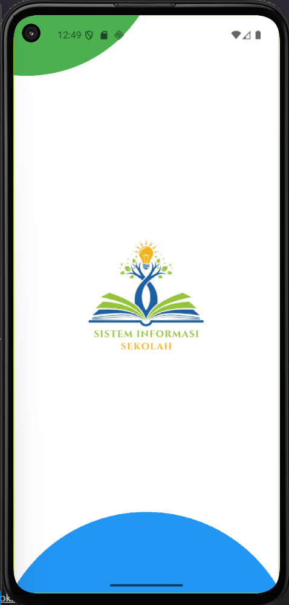
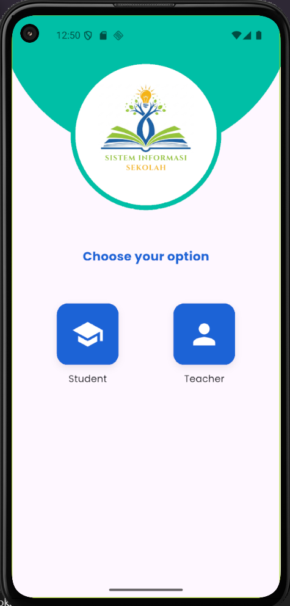

📱 Sistem Informasi Sekolah

Aplikasi mobile berbasis Flutter untuk siswa dan guru, dengan desain sesuai mockup Figma.

🚀 Fitur Utama

Splash Screen

Pilihan login (Student / Teacher)

Dashboard untuk siswa & guru

Menu navigasi (Profile, Attendance, Record, dll.)

Edit Profile guru

Desain UI simpel & responsive

📂 Struktur Project
lib/
 ┣ main.dart                # titik masuk aplikasi
 ┣ screens/                 # semua halaman 
 ┃ ┣ splash_screen.dart         # Splash Screen
 ┃ ┣ choose_option_screen.dart  # Choose your option
 ┃ ┣ teacher_login_screen.dart  # Teacher Login
 ┃ ┣ teacher_dashboard.dart     # Teacher Dashboard
 ┃ ┣ nav_menu.dart              # Navigation Menu
 ┃ ┣ teacher_attendance.dart    # Teacher Attendance
 ┃ ┣ record_screen.dart         # Record (CheckIn - CheckOut)
 ┃ ┣ teacher_profile.dart       # Teacher Profile
 ┃ ┣ edit_teacher_profile.dart  # Edit Teacher Profile
 ┃ ┣ student_login_screen.dart  # Student Login
 ┃ ┗ student_dashboard.dart     # Student Dashboard
 ┣ widgets/                 
 ┃ ┣ custom_button.dart
 ┃ ┣ custom_card.dart
 ┃ ┗ custom_navbar.dart
 ┣ models/                  # data struktur 
 ┃ ┣ user.dart
 ┃ ┗ attendance.dart
 ┗ services/                # API 

⚡ Instalasi & Menjalankan

Clone repo ini

git clone https://github.com/SyafiraNurulHanifa/sistem-akademik.git
cd sistem-akademik

Install dependencies

flutter pub get

Jalankan di emulator/device

flutter run

📸 Preview

